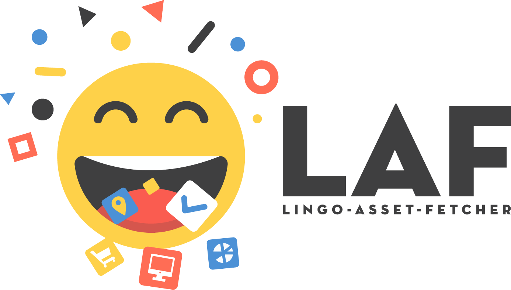

# LAF

> Automate asset retrieval from lingoapp.com



## Install

```
npm install laf -g
```

## Usage

#### Generate Config File

Config file is required.
Using generator to create the config file is optional.

###### 1. Generate configuration file

> Video Tutorial (1/2): [LAF - Gen](https://youtu.be/J3UH4K_Nu0g)

\$ `laf gen`

**Sample Config**

```json
{
  "name": ".laf.json",
  "value": {
    "kits": [
      {
        "name": "Capswan - Mobile App - Style Guide",
        "sections": [
          {
            "name": "Illustrations"
          },
          {
            "name": "Icons",
            "headers": ["Icons", "Components"]
          }
        ]
      },
      {
        "name": "Test Me",
        "sections": [
          {
            "name": "Illustrations",
            "headers": ["Lined"]
          }
        ]
      }
    ]
  }
}
```

###### 2. Fetch files

> Video Tutorial (2/2): [LAF - Fetch](https://youtu.be/AeN6RgTHCyQ)

\$ `laf fetch`

---

## Sketch + Lingo + LAF Workflow Comparisons


## Related

This CLI wraps `lingo-asset-fetcher-lib`

- `@github`: [lingo-asset-fetcher-lib](https://github.com/servexyz/lingo-asset-fetcher-lib)
- `@npm`: [lingo-asset-fetcher-lib](https://www.npmjs.com/package/laf-lib)
