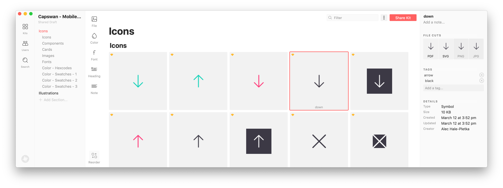
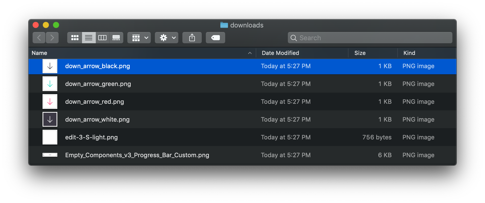
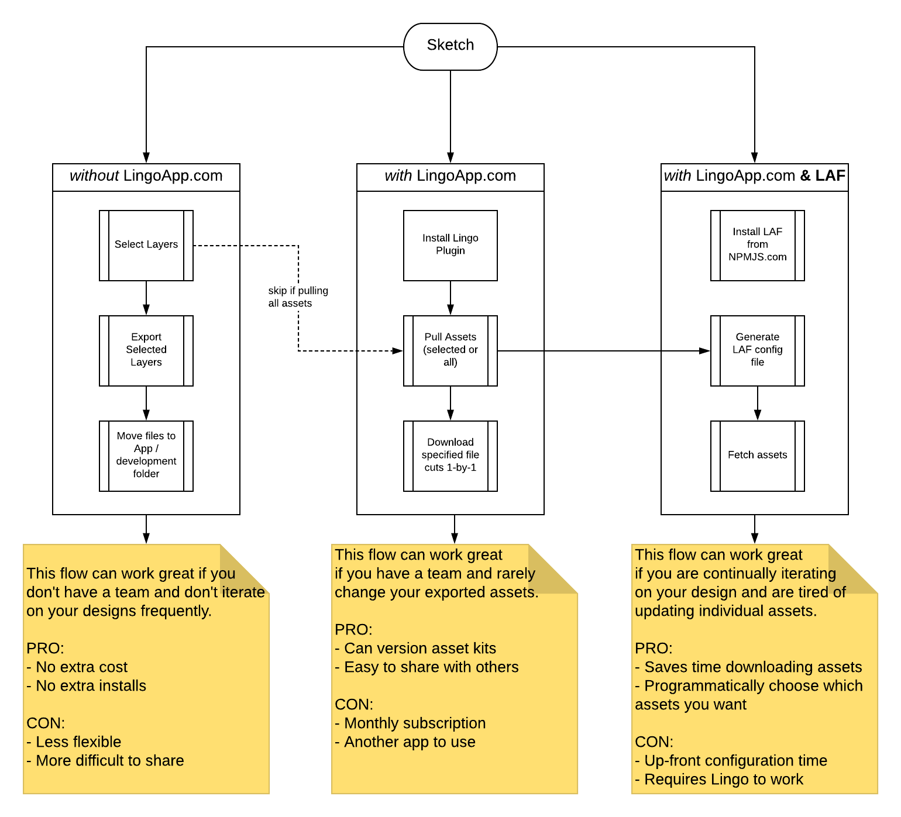

---

Automate asset retrieval from lingoapp.com

## Install

```
npm install laf -g
```

---

## Usage

In order to use LAF you will need two files in your current working directory:

1. `.laf.json`

   > This is your config file.

2. `.env`

   > You might already have this file. If that's the case, you just need to add your SpaceID & API Token. Both are supplied by LingoApp.com.

```
SPACE_ID=''
API_TOKEN=''
```

---

### 1. Generate Config File

> Video Tutorial (1/2): [laf gen](https://youtu.be/J3UH4K_Nu0g)

Config file is required.
Using generator to create the config file is optional.

\$ `laf gen`

#### Sample Config

##### Generated (Partial)

```json
{
  "kits": [
    {
      "name": "",
      "sections": [
        {
          "name": "",
          "headers": [""]
        }
      ]
    }
  ]
}
```

##### Generated & Edited (Complete)

```json
{
  "name": ".laf.json",
  "value": {
    "kits": [
      {
        "name": "Capswan - Mobile App - Style Guide",
        "sections": [
          {
            "name": "Illustrations"
          },
          {
            "name": "Icons",
            "headers": ["Icons", "Components"]
          }
        ]
      },
      {
        "name": "Test Me",
        "sections": [
          {
            "name": "Illustrations",
            "headers": ["Lined"]
          }
        ]
      }
    ]
  }
}
```

#### Output at this point

- `.laf.json` with semi-filled config

  > The tutorial in "Fetch files" walks you through finalizing this config

- `.env` with empty SPACE_ID & API_TOKEN keys

---

### 2. Fetch files

> Video Tutorial (2/2): [laf fetch](https://youtu.be/AeN6RgTHCyQ)

\$ `laf fetch`

#### CLI Flags

> You can call `laf fetch` without specifying flags. Flag defaults are listed below.
>
> Visit [here](http://developer.lingoapp.com/lingojs/#available-file-cuts) to read more about Lingo's available file cuts. This will show you what you conversion possibilities.

| Flag  | Alias | Description        | Defaults      |
| :---- | :---- | :----------------- | :------------ |
| --out | -o    | Download directory | "./downloads" |
| --cut | -c    | File type          | "PNG"         |

##### Examples

- \$ `laf fetch --out "./downloads" --cut "JPG"`
- \$ `laf fetch --out "./assets/foo" --cut "PNG"`

#### Output at this point

All of your files downloaded to the output directory you've specified

---

---

### Appendix

#### A. How file names are constructed

Downloaded filenames are a concatenation of asset name & tag names. Consider the following image:



The highlighted "down arrow" would be named:
`down_arrow_black.png` as you can see here:



#### B. `Sketch` + `Lingo` + `LAF` - Workflow Comparisons



### Related

This CLI wraps `lingo-asset-fetcher-lib`

- `@github`: [lingo-asset-fetcher-lib](https://github.com/servexyz/lingo-asset-fetcher-lib)
- `@npm`: [laf-lib](https://www.npmjs.com/package/laf-lib)

### Video Tutorials

1. [laf gen](https://youtu.be/J3UH4K_Nu0g)
2. [laf fetch](https://youtu.be/AeN6RgTHCyQ)

### Blog

> Explores the thought process behind LAF + future plans:

[Image download automation with Lingo & LAF](https://growbuildserve.com/laf/)
